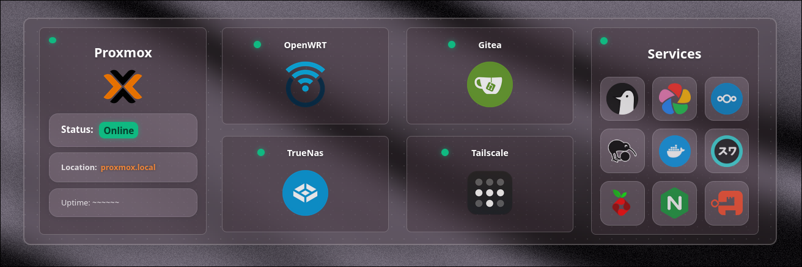

# Panoptes - Homelab Dashboard



**A minimal, self-hosted dashboard for your rack monitor!**

this is a personal project so in it's current state it is very inconvenient to change the actual services (sorry). But worry not! i plan to make the services changeable straight from the dashboard.

> NOTE: the API is heavily  vibe coded as i am still fairly unfamiliar with Javascript. ONLY use in trusted environments

## Installation

```bash
git clone <url> && cd panoptes
```

```bash
bun install && bun run build
```

```bash
bun run preview

```

once it's done cooking head to <http://localhost:4321>

## Features

- Real-time service status monitoring via API
- Auto-refresh every 15 minutes
- Responsive design (desktop/mobile)
- Configurable services in `src/config/dashboard.config.js`

## Stack

- Astro (static site generator)
- React (interactive components)
- Three.js (3D animations)
- Bun (runtime & package manager)

## API Endpoints

- `GET /api/status` - Returns service statuses
  - Query params: `?format=mapped|raw|summary`
  - `?refresh=true` - Force immediate status refresh

If you want to disable the API, you can do so by editing line 14 in `src/utils/serviceStatusMonitor.js`

```js
export const ENABLE_STATUS_CHECKS = false; //this will resolve everyhing to 'up'
```

## Configuration

Edit `src/config/dashboard.config.js` to add/remove services. Each service requires:

- `title`: Display name
- `icon`: Path to SVG icon
- `location.url`: URL for status checks
